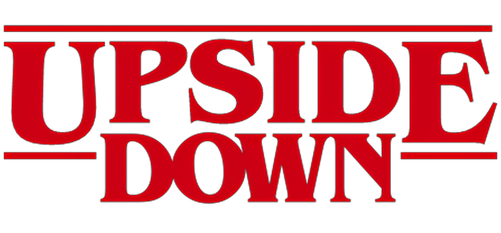
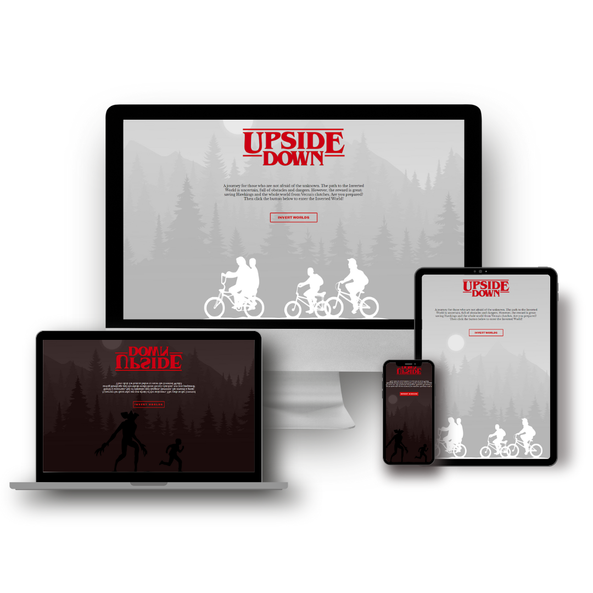

Uma jornada para quem não tem medo do desconhecido.
O caminho para o Mundo Invertido é incerto, repleto de obstáculos e perigos.
Porém, a recompensa é grande: salvar Hawkings e o mundo todo das garras de Vecna. Você está preparado(a)?.

Este projeto foi desenvolvido durante a semana frontend da DIO.

 

# 📄 Descrição

Este projeto é uma página web interativa para a série "Stranger Things", explorando o tema do mundo invertido presente na série.
A página permite que os usuários alternem entre dois temas: o tema light e dark, proporcionando diferentes experiências visuais.

 

# 💻 Tecnologias Utilizadas

- HTML5: para a estrutura e marcação da página
- CSS3: para a estilização e layout da página
- JavaScript (JS): para adicionar interatividade e funcionalidades à página

 

# 🗄️Estrutura do Projeto

- 📁 `assets`
  - 📁 `css`
  - 📁 `img`
    - 📁 `backgrounds`
    - 📁 `banner`
    - 📁 `characters`
    - 📁 `content`
    - 📁 `footer`
    - 📁 `readme`
  - 📁 `js`
  - 📁 `music`
- `index.html`

 

# Próximos Objetivos

- [ ] Implementar música de fundo ao site

 

# 🎨 Imagens do Projeto

